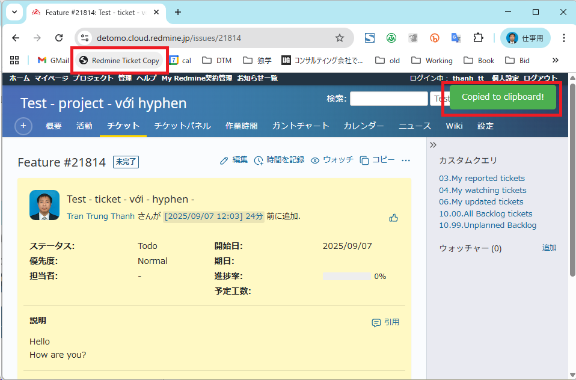

# ブックマークレット コレクション

[English](README.en.md) - [日本語](README.ja.md) - [Tiếng Việt](README.md)

ウェブページから情報を取得したり、ページを操作したりするのに便利なブックマークレットのコレクションです。生産性を向上させます。

## ブックマークレットとは？

**ブックマークレット**は、ウェブブラウザに*ブックマーク*として追加されるプログラムコードです。現在閲覧しているウェブページのコンテンツに対して、情報取得やデータ入力などの操作を実行できます。

ブックマークレットを使用すると、マウスクリック一回で複雑なタスクを実行できます。

## 提供されるブックマークレット コレクション

* [Redmine Ticket Copy](src/redmine-ticket-copy): Redmineチケットの情報をコピーしてドキュメントに貼り付け
* [Redmine Ticket for Slack](src/redmine-ticket-copy-markdown): Redmineチケットの情報をMarkdown形式でコピー（Slackで使用可能）

## 使用方法

1. **ブックマークに追加**: ブックマークレットのコードをコピーしてブックマークを作成
2. **使用**: 任意のウェブページで、ブックマーク（ブックマークバー上）をクリックしてブックマークレットを実行

### 使用手順

ウェブページを開いている状態で、ブックマークバーからブックマークレットをクリックします。

例：
1. Redmineチケットページを開く（例：`https://detomo.cloud.redmine.jp/issues/21814`）
2. ブックマークメニューまたはブックマークバーから`Redmine Copy Ticket`ブックマークをクリック
  
3. コードが実行され、以下のような内容が：
   ```
   Feature #21814: Test - ticket - với - hyphen -
   https://detomo.cloud.redmine.jp/issues/21814
   ```
   クリップボードにコピーされ、「Copied to clipboard!」のアラートが表示されます。

### ブックマークに追加

ブックマークレットコードをブックマークに保存するには、以下の手順に従ってください：

#### Google Chromeの場合
1. Chromeを開き、任意のページに移動（またはすぐに試すためにRedmineチケットページ）
2. ブックマークレットコード全体をコピー（`javascript:`を含む）：
   例
   ```javascript
   javascript:(function() {
      const heading = document.querySelector('#sticky-issue-header .issue-heading')?.innerText || '';
      const title = document.querySelector('#sticky-issue-header .subject')?.innerText || '';
      const url = window.location.href;
      const formatted = `${heading} ${title}\n${url}`;
      navigator.clipboard.writeText(formatted).then(() => {
         const div = document.createElement('div');
         div.textContent = 'Copied to clipboard!';
         div.style.cssText = 'position: fixed; top: 20px; right: 20px; background: #4CAF50; color: white; padding: 10px 20px; border-radius: 5px; z-index: 9999; opacity: 1; transition: opacity 1s ease-in-out;';
         document.body.appendChild(div);
         setTimeout(() => { div.style.opacity = '0'; }, 2000);
         setTimeout(() => { div.remove(); }, 3000);
      });
   })();
   ```
3. **ブックマークマネージャー**を開く：
   - `Ctrl + Shift + O`（Windows）または`Cmd + Shift + O`（Mac）を押す
   - または：三点メニュー → **ブックマークとリスト** → **ブックマークを管理**
4. 新しいブックマークを作成：
   - ブックマークマネージャーの三点メニューをクリック → **新しいブックマークを追加**
   - **名前**: `Redmine Copy Ticket`
   - **URL**: ブックマークレットコードをURLフィールドに貼り付け
5. **保存**をクリック
6. （オプション）クイックアクセスのためにブックマークをブックマークバーにドラッグ

#### Firefoxの場合
1. Firefoxを開き、上記と同様にブックマークレットコードをコピー
2. **ブックマーク**を開く：
   - `Ctrl + Shift + O`を押すか、三本線メニュー → **ブックマーク** → **ブックマークを管理**
3. ブックマークを作成：
   - **ブックマークメニュー**で**ブックマークを追加**をクリック
   - **名前**: `Redmine Copy Ticket`
   - **場所**: ブックマークレットコードを貼り付け
4. **保存**をクリック

#### Microsoft EdgeまたはSafariの場合
- Chromeと同様に、ブックマーク/お気に入りマネージャーを開き、新しいブックマークを作成し、コードをURLフィールドに貼り付けて、`Redmine Copy Ticket`などの名前で保存してください。
