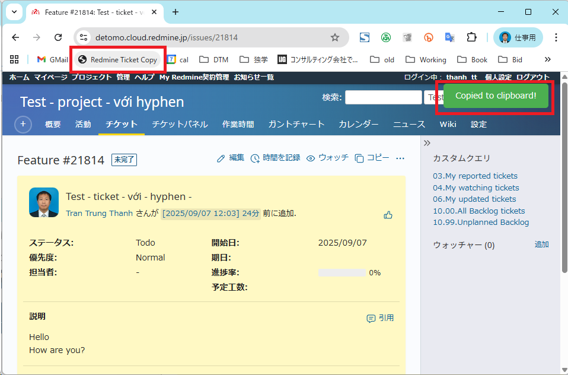

# Tập hợp Bookmarklet

[English](README.en.md) - [日本語](README.ja.md) - [Tiếng Việt](README.md)

Bộ sưu tập các bookmarklet hữu ích cho việc lấy thông tin hoặc thao tác trên trang web, làm tăng năng suất.

## Bookmarklet là gì?

**Bookmarklet** là một đoạn mã chương trình được đưa vào trình duyệt web của bạn dưới dạng *dấu trang* (bookmark). Nó sẽ giúp bạn xử lý một thao tác nào đó trên nội dung trang web đang xem như lấy thông tin, điền thông tin.

Sử dụng bookmarklet, ta chỉ cần một cú click chuột để thực hiện các tác vụ phức tạp.

## Tập hợp các bookmarklet được cung cấp

* [Redmine Ticket Copy](src/redmine-ticket-copy): Copy thông tin của một Redmine ticket để dán vào tài liệu.
* [Redmine Ticket for Slack](src/redmine-ticket-copy-markdown): Copy thông tin của một Redmine ticket, format dạng Markdown (có thể sử dụng trong Slack).

## Cách sử dụng

1. **Thêm vào bookmark**: Copy đoạn mã bookmarklet và tạo bookmark
2. **Sử dụng**: Khi đang ở trang web bất kỳ, click vào bookmark (trên thanh bookmark) để chạy bookmarklet

### Cách sử dụng

Khi đang mở một trang web, trên thanh bookmark, click vào bookmarklet.

Ví dụ:
1. Mở trang Redmine ticket (ví dụ: `https://detomo.cloud.redmine.jp/issues/21814`).
2. Click vào bookmark `Redmine Copy Ticket` từ Bookmarks Menu hoặc Bookmarks Bar.
  
3. Mã sẽ chạy, copy nội dung như:
   ```
   Feature #21814: Test - ticket - với - hyphen -
   https://detomo.cloud.redmine.jp/issues/21814
   ```
   vào clipboard và hiển thị alert "Copied to clipboard!".

### Thêm vào bookmark

Để lưu mã bookmarklet vào bookmark, làm theo các bước sau:

#### Trên Google Chrome
1. Mở Chrome, vào bất kỳ trang nào (hoặc trang Redmine ticket để thử ngay).
2. Copy toàn bộ mã bookmarklet (bao gồm `javascript:`):
   Ví dụ
   ```javascript
   javascript:(function() {
      const heading = document.querySelector('#sticky-issue-header .issue-heading')?.innerText || '';
      const title = document.querySelector('#sticky-issue-header .subject')?.innerText || '';
      const url = window.location.href;
      const formatted = `${heading} ${title}\n${url}`;
      navigator.clipboard.writeText(formatted).then(() => {
         const div = document.createElement('div');
         div.textContent = 'Copied to clipboard!';
         div.style.cssText = 'position: fixed; top: 20px; right: 20px; background: #4CAF50; color: white; padding: 10px 20px; border-radius: 5px; z-index: 9999; opacity: 1; transition: opacity 1s ease-in-out;';
         document.body.appendChild(div);
         setTimeout(() => { div.style.opacity = '0'; }, 2000);
         setTimeout(() => { div.remove(); }, 3000);
      });
   })();
   ```
3. Mở **Bookmark Manager**:
   - Nhấn `Ctrl + Shift + O` (Windows) hoặc `Cmd + Shift + O` (Mac).
   - Hoặc: Menu ba chấm → **Bookmarks and lists** → **Manage bookmarks**.
4. Tạo bookmark mới:
   - Click menu ba chấm trong Bookmark Manager → **Add new bookmark**.
   - **Name**: `Redmine Copy Ticket`.
   - **URL**: Dán mã bookmarklet vào trường URL.
5. Nhấn **Save**.
6. (Tùy chọn) Kéo bookmark vào Bookmarks Bar để truy cập nhanh.

#### Trên Firefox
1. Mở Firefox, copy mã bookmarklet như trên.
2. Mở **Bookmarks**:
   - Nhấn `Ctrl + Shift + O` hoặc Menu ba gạch → **Bookmarks** → **Manage bookmarks**.
3. Tạo bookmark:
   - Trong **Bookmarks Menu**, click **Add Bookmark**.
   - **Name**: `Redmine Copy Ticket`.
   - **Location**: Dán mã bookmarklet.
4. Nhấn **Save**.

#### Trên Microsoft Edge hoặc Safari
- Tương tự Chrome, mở Bookmark/Favorites Manager, tạo bookmark mới, dán mã vào trường URL, và lưu với tên như `Redmine Copy Ticket`.
